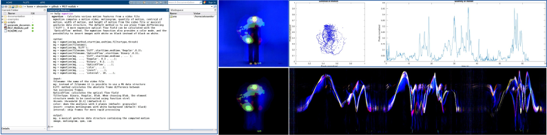

# Musical Gestures Toolbox for Matlab

The Musical Gestures Toolbox (MGT) is a Matlab toolbox for analysing music-related body motion, using sets of audio, video and motion capture data as source material.

It was primarily developed for music research, with a particular focus on studying the motion of musicians and dancers. But it can be used for any type of motion-related analysis based on video recordings.

## Functions

The Musical Gestures Toolbox contains a set of functions for the analysis and visualization of video, audio, and mocap data. There are four categories of functions:

- Data input and edit functions
- Data preprocessing functions
- Visualization functions
- Middle and higher level feature extraction functions

## Tutorial

Please refer to the [wiki pages](https://github.com/fourMs/MGT-matlab/wiki) for more information about installing and usage. Much of the same information is also available in the material for the software carpentry workshop [Quantitative Video analysis for Qualitative Research](https://alexarje.github.io/video-analysis-workshop/).

## Dependencies

1. Many of the basic things work with a standard Matlab install, but to use all features you will also need these extra Matlab packages:

    - Computer Vision System Toolbox
    - Image Processing Toolbox

2. Some of the functions build on code from these third-party toolboxes:

    - [matlabPyrTools](https://github.com/LabForComputationalVision/matlabPyrTools/archive/master.zip)
    - [MoCap Toolbox](https://www.jyu.fi/hum/laitokset/musiikki/en/research/coe/materials/mocaptoolbox)
    - [MIRtoolbox](https://www.jyu.fi/hum/laitokset/musiikki/en/research/coe/materials/mirtoolbox).

## History

The toolbox builds on the [Musical Gestures Toolbox for Max](http://www.uio.no/english/research/groups/fourms/downloads/software/musicalgesturestoolbox/), which has been developed by [alexarje](https://github.com/alexarje) since 2004, and parts of it is currently embedded in the [Jamoma](http://www.jamoma.org) project.

A large chunk of the code was written by [benlyyan](https://github.com/benlyyan) as part of his [M.Sc. thesis](https://www.duo.uio.no/handle/10852/51118) at the University of Oslo.

There is now also a [Musical Gestures Toolbox for Python](https://github.com/fourMs/MGT-python) with more or less the same functionality.

The software is maintained by the [fourMs lab](https://github.com/fourMs) at [RITMO Centre for Interdisciplinary Studies in Rhythm, Time and Motion](https://www.uio.no/ritmo/english/) at the University of Oslo.

## Reference

If you use this toolbox for research purposes, please reference this publication:

- Jensenius, Alexander Refsum (2018). [The Musical Gestures Toolbox for Matlab](http://hdl.handle.net/10852/65559). Proceedings of the 19th International Society for Music Information Retrieval Conference, Late Breaking Demos Session. Paris, France.

Many examples of the use of the toolbox can be found in this master's thesis: 

- Zhou, B. (2016). [Video Analysis of Music Related Body Motion in Matlab](http://urn.nb.no/URN:NBN:no-54640). Master’s Thesis. University of Oslo.

## Credits

Main developers: [Alexander Refsum Jensenius](http://people.uio.no/alexanje), [Bo Shou](https://github.com/benlyyan), and [Habibur Rahman](https://github.com/emoninet2).

## License

This software is open source, and is shared with [The GNU General Public License v3.0](https://www.gnu.org/licenses/gpl-3.0.html).
